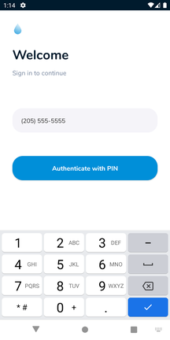
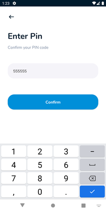
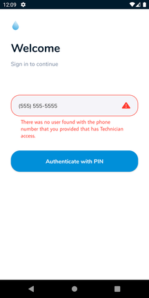
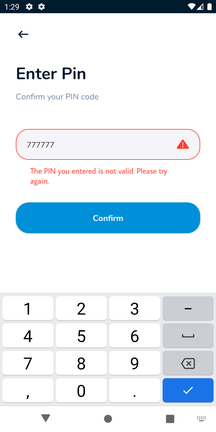

# Authentication

The Technician app authenticates a user by sending a PIN to their phone number. 

To login, enter your phone number in the form. 

At the Enter Pin screen, enter the PIN you received through SMS.

## Errors

### No User Found

If your phone number is not in the system, or if you do not have Technician Access you
will receive this error. You will need to have someone with Operator Access resolve this
for you.

### Invalid PIN

You have entered the wrong number for your PIN. 

