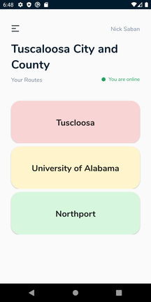
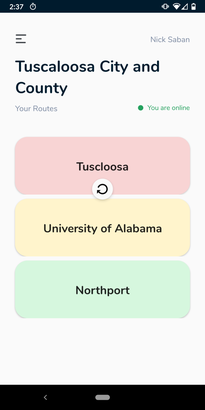

# Routes Screen

## Overview

The routes screen displays the routes you have access to. Routes are also color coded,
so you can check if they have been completed.

- **Red:** None of the items on this route have been completed
- **Yellow:** Some items on this route have been completed
- **Green:** All the items on this route have been completed

## Swipe to Refresh

If you would like to update the read status of the routes, you can swipe down on your phone
to activate swipe to refresh.

