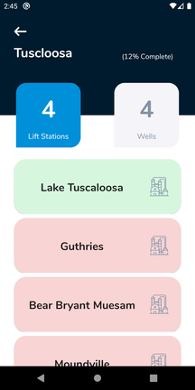
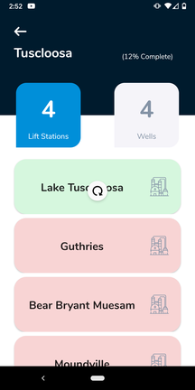
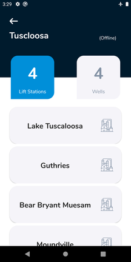

# Lift Stations and Wells

## Overview

Once you select a route you will be brought to the Lift Stations and Wells screen.
This screen displays the Lift Stations and Wells that belong to a route. Notice that
the top right corner displays the percentage that that route has been completed.

- **Green Button:** this Lift Station or Well has been read
- **Red Button:** this Lift Station or Well has not been read

## Swipe to Refresh

Like the Routes screen, the Lift Stations and Wells screen supports Swipe to Refresh.
This can be used to update the read status of a route.

## Offline Mode

If an internet connection is unavailable or if the server is down the app will load in
offline mode. Note that in offline mode you will be unable to determine which wells have
been read.

